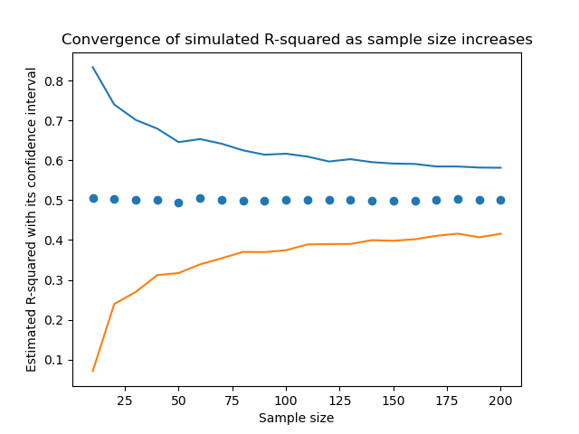
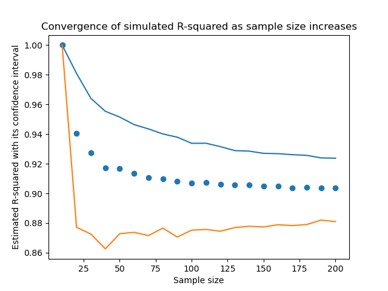

# Statistical-Learning-Methods
What I have learned from the course "Statistical Learning Methods" in Warsaw School of Economics during 2023-spring semester.

 

## 1. Plotting simulated R-squared (2/27)
File name: _plotting_simulated_R-squared.py_  
A homework for the very beginning of the course in which I had to write a Python code to plot a simulated R-squared at each sample size.

---
$$R^{2} = 1- \dfrac{\sum(Y_{i}-\hat{Y})^{2}}{\sum{(Y_{i}-\overline{Y})^{2}}} = 1 - \dfrac{MSE}{Var(Y)} \tag{1}$$

$Y$: response variable to be predicted by model  
$\hat{Y}$: predicted value for $Y$ by model  
$\overline{Y}$: average of $Y$ over $n$ observations  
$MSE$: mean of squared error, $SSE/n$  
$Var(Y)$: variance of Y 

 

**R-squared from a simple linear model**

$$\begin{gather}
Y = 1 + X + e\\
\hat{Y} = \hat{\alpha} + \hat{\beta}X
\end{gather} \tag{2}$$

First equation is the true model and the second one is a estimated simple linear regression.

$Y$: response variable  
$X$: independent variable following a standard Gaussian, $N(0, 1)$  
$e$: error term following a standard Gaussain, $N(0, 1)$  
$\hat{\alpha}$: estimated intercept  
$\hat{\beta}$: estimated coefficient for $X$

$X$ and $e$ are $iid$ from a standard Gaussian so, $Var(Y)$ is simply $2$. Since we are using the right specification for the true model, $Y-\hat{Y} \simeq e$ and MSE is just around $Var(e)$, which is $1$. So, the true $R^{2}$ should be around $1 - 1/2 = 0.5$.

The blue line and orange line are the 95% quantile line and the 5% quantile line at each sample size respectively, and the dots in the middle are mean of the simulated R-squared at each sample size.

 

**R-squared from a multiple linear model**

$$\begin{gather}
Y = 1 + X_{1} + ... + X_{10} + e\\
\hat{Y} = \hat{\alpha} + \hat{\beta_{1}}X_{1} + ... + \hat{\beta_{1}}X_{9}
\end{gather} \tag{3}$$

The number of independent variables is 9, so we have 10 parameters to estimate. All of the independent variables, $X_{1}, ..., X_{9}$ and $e$ are $iid$ from a standard Gaussian so, $Var(Y)$ here is $10$. Here the second model well specifies the true model, $Y-\hat{Y} \simeq e$ and MSE is just around $Var(e)$, which is $1$. So the true $R^{2}$ should be around $1 - 1/10 = 0.9$.

One fun fact on the chart is that there are no error bounds when the sample size is equal to the number of parameters to be estimated (in this case, 10). It is because we can find the unique solution for the linear system of $Y=X\beta$, since $X$ is a square matrix with full rank in this special case. In other words, we can take a linear combination of the columns of $X$ to exactly represent $Y$. 
